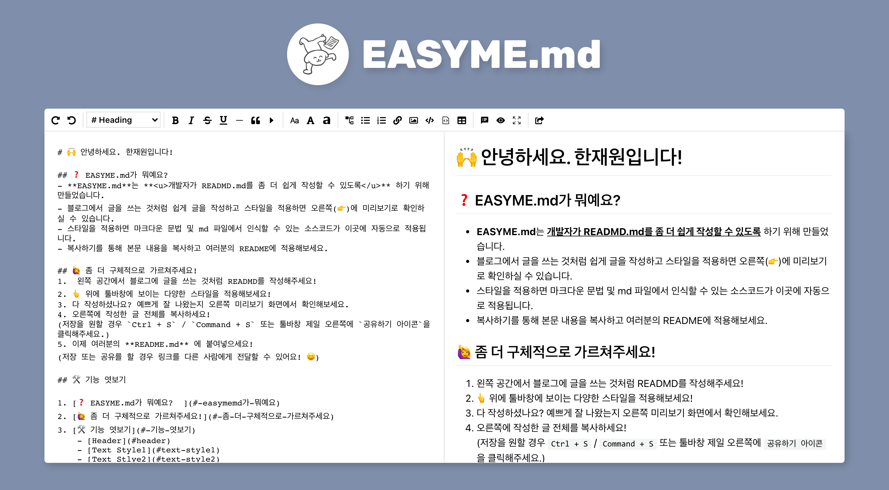

# 😉 EASYME.md

`#README` `#Markdown` `#리드미` `#빠르고쉽게` `#에디터`   

README.md를 쉽게 작성하는 방법! **EASYME.md**   

---



Markdown 문법, 알고는 있는데.. <u>README.md 작성할 때만 되면 버벅거리는 당신.</u> 지금 'Markdown 사용법'이라고 검색하고 계신거 아니죠? 🤭   
이젠 더 이상 그럴 필요가 없어요. **EASYME.md를 통해 쉽게 Markdown을 작성할 수 있거든요.**   
왼쪽 화면에 글을 작성하면 오른쪽 화면에 실시간으로 Markdown이 적용된 글을 확인할 수 있어요. Markdown 문법이 잘 기억나지 않는다고요? 괜찮아요! 🙂 툴바창에 다양한 기능을 적용하면 자동으로 Markdown 문법이 적용되니까요.   
어때요? 이제 쉽게 README.md를 작성할 수 있겠죠?   

*(🤙 지금 이 글도 EASYME.md를 통해 작성하였답니다)*

<br>

# 📖 Contents

- [😉 EASYME.md](#-easymemd)
- [📖 Contents](#-contents)
- [🔍 Preview](#-preview)
- [🛠 Features](#-features)
- [⚠️ Requirement](#️-requirement)
- [⚙️ Installation](#️-installation)
- [🪃 Skills](#-skills)
- [🪛 Project Control](#-project-control)
- [🚀 Deployment](#-deployment)
- [🧗 Challenges](#-challenges)

<br>

# 🔗 Link

- [https://www.easyme.online/](https://www.easyme.online/)

## Github Repositories

- Client: [https://github.com/EASYME-md/client](https://github.com/EASYME-md/client)
- Server: [https://github.com/EASYME-md/server](https://github.com/EASYME-md/server)

<br>

# 🔍 Preview


<br>

# 🛠 Features

- Custom Toolbar
    - 커서 위치, 텍스트 드래그에 따라 Markdown 기능이 적용됩니다.
    - 드래그한 영역을 대소문자로 변형을 해줍니다.
    - 드래그한 영역을 리스트로 만들어줍니다.
    - 접기, 목차, 테이블 등의 템플릿을 제공합니다.
    - Editor 화면만 보기, Markdown 화면만 보기, Full Screen 모드를 제공합니다.

- 공유하기
    - 공유하기 아이콘 버튼을 클릭하면 링크가 생성됩니다.
    - 작성한 글을 저장하고 다른 사람에 공유할 수 있습니다.
    - 작성 도중 단축키 `Ctrl+S(Command+S)`로 글을 저장할 수도 있습니다.

<br>

# ⚠️ Requirement

최신 Chrome Browser 사용을 권장합니다.

<br>

# ⚙️ Installation

## Setup

- Local 환경에서 실행하기 위해 아래 사전 준비가 필요합니다.
    - [MongoDB Address](https://www.mongodb.com/ko-kr/cloud/atlas/efficiency)

## Client

```
git clone https://github.com/EASYME-md/client
cd client
npm install
npm start
```

- root 디렉토리에 `.env` 파일을 생성하고 아래 내용을 삽입해주세요.

```
REACT_APP_SERVER_URI=https://api.easyme.online
REACT_APP_CLIENT_URI=https://easyme.online
```

## Server

```
git clone https://github.com/EASYME-md/server
cd server
npm install
npm start
```

- root 디렉토리에 `.env` 파일을 생성하고 `<>`에 환경변수를 입력 후 저장해주세요.

```
MONGODB_ADDRESS=<mongoDB address>
CLIENT_URI=https://easyme.online
```

<br>

# 🪃 Skills

## Client

- ES2015+
- React
- React Router
- React Helmet
- Redux Toolkit
- Redux Saga
- Emotion

## Server

- ES2015+
- Node.js
- Express
- MongoDB Atlas
- Mongoose

## Test

- Client: Jest, Testing Library
- Server: Mocha, Chai, Supertest

<br>

# 🪛 Project Control

- Version Control: Git, Github
- Task Control: Notion, Figma

<br>

# 🚀 Deployment

- Client: Netlify
- Server: AWS Elastic Beanstalk

<br>

# 🧗 Challenges

3주 동안 프로젝트를 진행하면서 겪은 어려움 또는 도전은 아래와 같습니다.

## React Quill을 걷어내다

초기 에디터 구현은 현재 작업이 완료된 `<textarea>`가 아닌 `React Quill`이라는 에디터 라이브러리를 사용했습니다. Quill에서 제공하는 기본 메서드와 Custom Toolbar 등으로 작업을 시작한 1주차에 기능 구현이 거의 마무리가 되었습니다. 생각보다 일찍 기능 구현이 끝났기 때문에 스스로에게도 고민이 생겼습니다. 기능 외에 것들을 더 신경 쓸 수 있는 시간이 확보되었다는 것은 긍정적인 사실이나, **'기술적인 도전과 성장'에 초점을 두었을 때 스스로에게 이로운 방향은 아닐 수도 있겠다는 생각이 들었습니다.** 그래서 과감하게 Quill을 걷어내고 기본으로 제공하는 `<textarea>`를 사용하기로 결정했습니다.

결론적으로, `<textarea>`를 사용했을 때 오히려 이로운 점이 많았습니다. 기존에 Quill을 사용했을 때는 Quill에 의존하여 제한적인 부분이 많았습니다. Quill에서는 module과 format을 세팅해야 하는 번거로움이 있었고, module안에 Custom Toolbar의 Event Handling을 구현할 때 각각 Component로 구현하는 것이 아닌 Event Handling 함수를 직접 넣어줘야 했습니다. 그래서 각각의 Tool을 보여주는 Component를 만들고 그 안에 해당 기능을 동작하는 Event Handling 함수를 넣는 것이 아니라 따로 바깥에 만들어주고 export 시켜준 함수를 import 받아서 module에 적용해야만 했습니다. 폴더 구조나 코드가 복잡해진다는 단점도 존재했습니다.

`<textarea>`로 변경한 후에 훨씬 유연해졌습니다. 각 기능과 동작을 Component 안에서 모두 해결할 수 있었습니다. Component도 훨씬 깔끔해졌습니다. Quill 내부에 값들을 `console.log`를 통해 확인해가며 기능을 적용시켰던 경험이 `<textarea>`에서도 고스란히 도움이 되었습니다. 커서의 위치, 드래그 영역 계산, 드래그가 여러 행일 경우 각 행의 첫번째 index를 찾는 것 등 `<textarea>`가 Quill에 비해 잘 정제되어 있지는 않았지만 보다 내부 메서드나 value가 방대했고 잘 적용하기만 한다면 제한적인 부분이 덜했기 때문에 `<textarea>`로 이전한 것은 좋은 결정이었다고 생각합니다.

## Redo, Undo가 작동하지 않다

`<textarea>`를 사용할 경우 큰 문제점이 하나 있었습니다. 바로 redo, undo(`Ctrl/Command+Z` 포함)가 작동되지 않는다는 것입니다. textarea의 current.value 값을 찾아서 직접 변경해주기 때문에 이전 값을 기억하지 못하는 것이라 생각되었습니다.

이에 대해 `document.execCommand()`를 사용하여 해결할 수 있었습니다. 하지만 MDN에 따르면 해당 메서드는 더 이상 사용하지 않으며 권장하지 않는 방법이라고 명시되어 있었습니다. 오랜 시도와 도전 끝에 '변경된 값을 그대로 `return`하는 게 아니라 `return`하기 전에 replace를 해주면 되지 않을까?'라는 아이디어가 떠 올랐고 `replace()`를 사용했지만 끝내 실패했습니다.

해결책을 마련하기 위해 여러 차례 방법을 모색하던중 `text-field-edit`이라는 라이브러리를 알게되었습니다. 해당 라이브러리는 자체적으로 텍스트를 다른 텍스트로 감싸주거나 insertText 기능 등 Markdown 문법을 적용하기에 훨씬 수월하게 설계되어 있었던 라이브러리였습니다. **하지만 단순히 라이브러리로 쉽게 적용하는 것은 스스로의 성장에도 도움이 되지 않을 거라 판단했고,** textarea 안에 요소들을 토대로 직접 구현하는 게 더 의미가 있다고 생각했습니다. 대신에 해당 라이브러리의 `replace` 기능만 활용하기로 했습니다. 초기에 생각했던 아이디어의 가능여부를 확인하고 싶었기 때문입니다. 결국 `replace`를 사용하여 redo, undo가 작동되는 것을 확인할 수 있었습니다.

내 아이디어가 어느정도 증명되었다는 것에서 뿌듯함을 느낀 것은 사실이지만 라이브러리의 도움 없이 직접 구현해보고 싶었던 마음이었기에 내심 아쉬움도 있습니다. 이 부분은 여기서 끝내지 않고 스스로가 더 성장할 수 있도록 직접 구현에 도전할 예정입니다.
